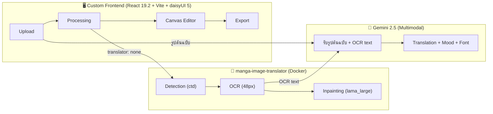

# MG_Translater — Manga Translation Web App (v2)

ใช้ **manga-image-translator** เป็น engine หลัก (detection, OCR, inpainting) รันผ่าน Docker  
ใช้ **Gemini 2.5** รับ **รูปต้นฉบับ** + OCR text → แปล + mood + font suggestion  
สร้าง **custom frontend** (React 19.2 + Vite + TypeScript + **Tailwind CSS 4 + daisyUI 5**)

---

## Architecture

---

## Split Pipeline (แนวทางที่ 2 ✅)

1. **manga-image-translator** (`translator: "none"`) → bounding boxes + OCR text + cleaned image
2. **Gemini 2.5** (ส่ง **รูปต้นฉบับ** + OCR text + bboxes) → คำแปลไทย + mood + font suggestion
   - AI เห็นภาพจริง → อ่านอารมณ์ตัวละคร, ลักษณะ bubble, บริบทของฉากได้แม่นยำ
3. **Frontend** รวมร่าง → ผู้ใช้แก้ไขใน Canvas Editor

---

## Proposed Changes

### 1. Project Setup

#### [NEW] [docker-compose.yml](file:///d:/MG_Translater/docker-compose.yml)
manga-image-translator backend (port 5003), GPU optional

#### [NEW] [package.json](file:///d:/MG_Translater/package.json)
Vite + **React 19.2** + TypeScript + `fabric` + `@google/genai` + `tailwindcss` + `daisyui`

#### [NEW] [vite.config.ts](file:///d:/MG_Translater/vite.config.ts)
Proxy `/api` → `http://localhost:5003`

#### [NEW] [app.css](file:///d:/MG_Translater/app.css)
Tailwind CSS 4 imports + daisyUI 5 plugin + dark theme (daisyUI `dark` / `abyss` theme)

---

### 2. Backend Communication

#### [NEW] [src/services/translator-api.ts](file:///d:/MG_Translater/src/services/translator-api.ts)
- `translateImage(file, config)` → POST `/translate/with-form/json/stream`
  - Config: `{ translator: { translator: "none" }, inpainter: { inpainter: "lama_large" }, detector: { detector: "ctd" } }`
  - Returns: bounding boxes, OCR text, inpainted image
- Stream parsing (binary: 1B status + 4B size + nB data)

#### [NEW] [src/services/gemini.ts](file:///d:/MG_Translater/src/services/gemini.ts)
- `translateWithImage(imageBase64, ocrTexts[], bboxes[], sourceLang)`
  - ส่ง **รูปต้นฉบับเต็ม** ให้ Gemini เห็นภาพจริง
  - AI อ่าน: สีหน้าตัวละคร, ขนาด/สไตล์ bubble, ฉากหลัง, context
  - Returns: `{ original, translated, mood, suggestedFont }[]`
- Prompt ใช้ทั้ง visual context + OCR text → mood detection + font suggestion ที่แม่นยำ

---

### 3. UI Components (daisyUI 5)

> [!NOTE]
> ใช้ daisyUI components เป็นหลัก: `btn`, `card`, `modal`, `tabs`, `steps`, `dropdown`, `file-input`, `range`, `toast`
> Custom CSS เฉพาะ canvas editor area เท่านั้น

#### [NEW] [src/App.tsx](file:///d:/MG_Translater/src/App.tsx)
4-step workflow: daisyUI `steps` component — Upload → Process → Edit → Export

#### [NEW] [src/components/Upload/ImageUploader.tsx](file:///d:/MG_Translater/src/components/Upload/ImageUploader.tsx)
Drag & drop zone + daisyUI `file-input`, `card`, preview thumbnails

#### [NEW] [src/components/Processing/ProcessingView.tsx](file:///d:/MG_Translater/src/components/Processing/ProcessingView.tsx)
daisyUI `progress`, `loading`, `alert` — real-time stream progress

---

### 4. Canvas Editor

#### [NEW] [src/components/Editor/CanvasEditor.tsx](file:///d:/MG_Translater/src/components/Editor/CanvasEditor.tsx)
Fabric.js canvas: inpainted image background + draggable/resizable text boxes, zoom & pan

#### [NEW] [src/components/Editor/PropertiesPanel.tsx](file:///d:/MG_Translater/src/components/Editor/PropertiesPanel.tsx)
daisyUI `input`, `select`, `range` — original/translated text, font/size/color controls

#### [NEW] [src/components/Editor/FontSelector.tsx](file:///d:/MG_Translater/src/components/Editor/FontSelector.tsx)
daisyUI `dropdown` — built-in fonts + AI suggestion `badge`, live preview

---

### 5. Font Config Page

#### [NEW] [src/components/Settings/FontConfigPage.tsx](file:///d:/MG_Translater/src/components/Settings/FontConfigPage.tsx)
- daisyUI `table` — **Mood → Font mapping** (editable)
- daisyUI `file-input` — อัพโหลด custom font (.ttf/.otf/.woff2)
- Font preview per mood, Save/Load presets

#### [NEW] [src/config/fonts.ts](file:///d:/MG_Translater/src/config/fonts.ts)
Default mood mapping + `getMoodFont()` + `registerCustomFont()`

---

### 6. Before/After & Export

#### [NEW] [src/components/Comparison/SplitView.tsx](file:///d:/MG_Translater/src/components/Comparison/SplitView.tsx)
daisyUI `range` slider / `tabs` for side-by-side / overlay toggle

#### [NEW] [src/services/exporter.ts](file:///d:/MG_Translater/src/services/exporter.ts)
Export canvas เป็น **PNG / JPG / WebP** (original resolution)

#### [NEW] [src/components/Settings/SettingsPanel.tsx](file:///d:/MG_Translater/src/components/Settings/SettingsPanel.tsx)
daisyUI `modal`, `input` — Gemini API Key, source lang, server URL

---

### 7. Types

#### [NEW] [src/types/index.ts](file:///d:/MG_Translater/src/types/index.ts)
`TextRegion`, `TranslatorConfig`, `FontMoodMap`, `ProcessingState`

---

## Verification Plan

1. `docker compose up` → backend running
2. `npm run dev` → frontend running (Tailwind + daisyUI hot reload)
3. Upload manga → JSON response (bboxes, OCR text)
4. Gemini (รูป + text) → Thai translation + mood
5. Canvas editor → drag/edit text boxes
6. Split view + Export PNG/JPG/WebP
